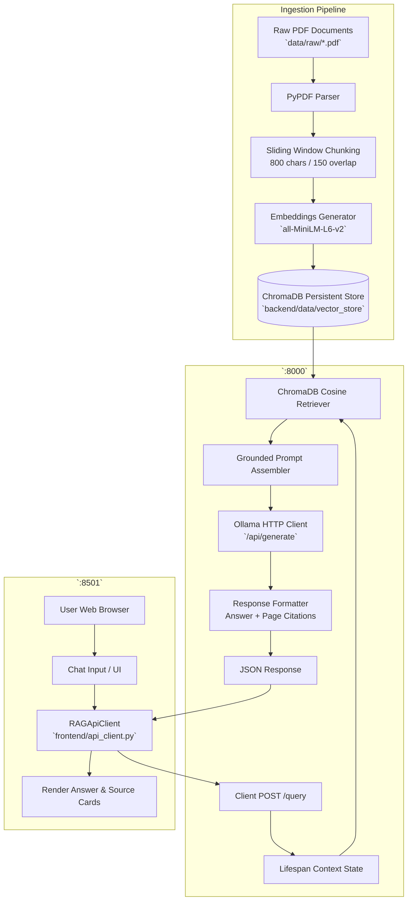

# 📚 RAG-Powered Document Assistant

[](https://www.python.org/)
[](https://fastapi.tiangolo.com)
[](https://streamlit.io)
[](https://www.trychroma.com/)
[](https://ollama.ai)
[](LICENSE)

An enterprise-grade, production-style **Retrieval-Augmented Generation (RAG) Document Assistant** designed for academic and technical document corpora. The system allows users to ask natural language questions about complex course materials and receive strictly grounded answers with verifiable, page-level source citations.

Built with **FastAPI**, **ChromaDB**, **Sentence-Transformers**, **Ollama**, and **Streamlit**, this project demonstrates end-to-end full-stack AI engineering, from document preprocessing and vector indexing to asynchronous API serving, graceful degradation, and interactive UI design.

---

## 🌟 Major Features

- **Document Parsing & Text Extraction**: Robust PDF extraction utilizing `PyPDF` with per-page text normalization, char/word counting, and OCR requirement detection.
- **Context-Preserving Sliding Window Chunking**: Chunks text into 800-character segments with 150-character overlap, aligning chunk cuts to sentence and whitespace boundaries to retain full semantic context.
- **Dense Vector Indexing**: Encodes chunks into 384-dimensional dense vectors using `sentence-transformers/all-MiniLM-L6-v2` and persists them to disk using **ChromaDB** with HNSW cosine similarity space.
- **Grounded Anti-Hallucination Prompting**: System prompt strictly constrains the LLM to provide answers exclusively derived from retrieved passages. If facts are absent, it cleanly refuses with: *"I could not find this information in the provided documents."*
- **Asynchronous FastAPI Backend**:
  - `lifespan` manager loads the vector store and embedding models **once at startup** (zero per-request re-initialization overhead).
  - Pydantic v2 schemas for strict input validation, returning standard `422 Unprocessable Entity` for empty or malformed inputs.
  - Informative health probe (`GET /health`) checking vector store readiness and Ollama connectivity.
- **Graceful Degradation Fallback**: If the local Ollama LLM is offline or unreachable, the system automatically surfaces an extractive grounded synthesis directly from top-ranked chunks with diagnostic guidance.
- **Interactive Streamlit UI**: Chat-style interface featuring real-time loading spinners, formatted answers, and expandable **source citation cards** detailing source document, page number, and similarity relevance scores.
- **Complete Test Suite & Automated Evaluation**: Pytest test suite covering valid and invalid query paths, plus an empirical 10-question evaluation benchmark with results exported to CSV.

---

## 🏛️ System Architecture



---

## 🧰 Technology Stack

| Technology | Role | Description |
| :--- | :--- | :--- |
| **Python 3.10 / 3.11** | Core Language | Modern Python runtime utilizing asynchronous I/O and strict type hinting |
| **FastAPI** | REST API Framework | High-performance async web framework for the query and health endpoints |
| **Uvicorn** | ASGI Web Server | Production lightning-fast ASGI server with multi-worker support |
| **Pydantic v2** | Data Validation | Request and response schema definitions, payload sanitization, and settings management |
| **ChromaDB** | Vector Database | Local, persistent embedded vector database utilizing HNSW indexing |
| **Sentence-Transformers** | Embedding Model | `all-MiniLM-L6-v2` generating 384-dimensional dense semantic vectors |
| **PyPDF** | PDF Text Extraction | Lossless PDF text extraction and document inspection |
| **Ollama** | Local LLM Runtime | Private local inference server running models such as `llama3.2` or `mistral` |
| **Streamlit** | Web Interface | Interactive chat UI with session state, dynamic cards, and system status widgets |
| **HTTPX** | Async HTTP Client | Asynchronous client for backend-to-Ollama and frontend-to-backend communication |
| **Pytest** | Testing Suite | Automated integration and unit test suite with mock services |
| **Docker & Compose** | Containerization | Multi-container orchestration for backend and frontend deployment |

---

## 📂 Project Structure

```text
rag-assistant-project/
├── notebooks/
│   └── rag_pipeline.ipynb          # Step-by-step interactive Jupyter notebook (Sections 1-9)
│
├── backend/
│   ├── app/
│   │   ├── __init__.py
│   │   ├── main.py                 # FastAPI application factory, lifespan, CORS, and routing
│   │   │
│   │   ├── api/
│   │   │   ├── __init__.py
│   │   │   └── routes/
│   │   │       ├── __init__.py
│   │   │       └── query.py        # Handlers for GET /health and POST /query
│   │   │
│   │   ├── core/
│   │   │   ├── __init__.py
│   │   │   └── config.py           # Pydantic Settings loading environment variables
│   │   │
│   │   ├── schemas/
│   │   │   ├── __init__.py
│   │   │   └── query.py            # Pydantic models: QueryRequest, QueryResponse, SourceItem, HealthResponse
│   │   │
│   │   ├── services/
│   │   │   ├── __init__.py
│   │   │   ├── retrieval.py        # VectorStoreService: ChromaDB persistent search
│   │   │   └── generation.py       # OllamaGenerationService: prompt building & LLM inference
│   │   │
│   │   └── utils/
│   │       ├── __init__.py
│   │       └── logging_config.py   # Structured logging configuration
│   │
│   ├── data/
│   │   └── vector_store/           # Persisted ChromaDB vector database index files
│   │
│   ├── tests/
│   │   ├── __init__.py
│   │   └── test_query.py           # Unit and integration tests (200, 422, mocks)
│   │
│   ├── requirements.txt            # Backend dependencies
│   ├── .env.example                # Backend configuration template
│   └── Dockerfile                  # Production container definition for FastAPI
│
├── frontend/
│   ├── app.py                      # Streamlit interactive chat web application
│   ├── api_client.py               # Robust HTTP client wrapping backend endpoints
│   ├── requirements.txt            # Frontend dependencies
│   ├── .env.example                # Frontend configuration template
│   └── Dockerfile                  # Container definition for Streamlit UI
│
├── data/
│   ├── README.md                   # Dataset domain description and ingestion guidelines
│   ├── raw/                        # Source PDF documents
│   │   ├── cs101_data_structures.pdf
│   │   ├── cs102_operating_systems.pdf
│   │   ├── cs103_database_systems.pdf
│   │   └── cs104_computer_networks.pdf
│   └── processed/
│       └── chunks_metadata.json    # Preprocessed chunk metadata and extraction stats
│
├── evaluation/
│   ├── evaluate.py                 # Automated benchmark evaluation runner
│   └── evaluation_results.csv      # Empirical 10-question evaluation table
│
├── scripts/
│   ├── generate_sample_documents.py # Generates authentic CS educational PDFs
│   ├── index_documents.py          # Document parsing, chunking, embedding, and vector persistence
│   └── create_notebook.py          # Generates notebooks/rag_pipeline.ipynb
│
├── .gitignore                      # Excludes cache, logs, virtual environments, large data
├── .env.example                    # Root environment variable template
├── docker-compose.yml              # Multi-container orchestration
└── README.md                       # Comprehensive project documentation
```

---

## 🚀 Quickstart Installation & Setup

### 1. Clone the Repository
```bash
git clone https://github.com/ebrahimahmed2410/RAG-_ASSISTANT_PROJECT.git
cd RAG-_ASSISTANT_PROJECT
```

### 2. Create and Activate Virtual Environment
```bash
# Windows
python -m venv .venv
.venv\Scripts\activate

# Linux / macOS
python3 -m venv .venv
source .venv/bin/activate
```

### 3. Install Dependencies
```bash
pip install -r backend/requirements.txt
pip install -r frontend/requirements.txt
```

---

## 🦙 Ollama Local LLM Setup

The assistant uses [Ollama](https://ollama.ai/) to run open-weight language models locally without cloud API costs or data privacy concerns.

1. **Install Ollama**:
   - Download for Windows/macOS/Linux from [ollama.ai/download](https://ollama.com/download).
2. **Start the Ollama Server**:
   ```bash
   ollama serve
   ```
3. **Pull the Desired Model**:
   ```bash
   ollama pull llama3.2
   ```
   *(Alternatively, use `ollama pull mistral` or `ollama pull phi3` and update `OLLAMA_MODEL` in your `.env` file).*

> [!NOTE]
> If Ollama is not installed or running, the backend's built-in **graceful degradation** mechanism will automatically detect connection failure and deliver a verified grounded passage summary extracted directly from your retrieved documents.

---

## 📖 Dataset & Document Ingestion

The system comes pre-configured with four university-level Computer Science educational documents in `data/raw/`:
1. `cs101_data_structures.pdf` (Arrays, Linked Lists, BSTs, AVL Trees, Hash Tables, Quicksort, Binary Search).
2. `cs102_operating_systems.pdf` (Processes, Threads, CPU Scheduling, Coffman Deadlock Conditions, Paging, LRU).
3. `cs103_database_systems.pdf` (Relational Algebra, SQL, Normalization 1NF-BCNF, ACID Transactions, 2PL, B+ Trees).
4. `cs104_computer_networks.pdf` (OSI 7-Layer, IPv4 Subnetting, OSPF vs RIP, TCP vs UDP, DNS, HTTP/2).

### To Ingest and Build the Vector Store:
Run the standalone ingestion script:
```bash
python scripts/index_documents.py
```
This extracts text, computes chunks, generates Sentence-Transformer embeddings, and writes the persistent HNSW index into `backend/data/vector_store/`.

---

## 📓 Running the Jupyter Notebook

The complete end-to-end pipeline is demonstrated in an interactive Jupyter Notebook:
```bash
jupyter notebook notebooks/rag_pipeline.ipynb
```
Select **Kernel → Restart & Run All**. The notebook executes top-to-bottom across all 9 required sections:
1. **Project Overview & Tech Stack**
2. **Document Loading & Inspection**
3. **Chunking Strategy & Boundary Awareness**
4. **Embeddings Inspection**
5. **ChromaDB Vector Store Persistence**
6. **Semantic Similarity Retrieval**
7. **Grounded Prompt Construction**
8. **Ollama LLM Generation**
9. **Evaluation Benchmark Table & Analysis**

---

## ⚙️ Running the Backend (FastAPI)

Start the FastAPI ASGI server with auto-reload:
```bash
cd backend
uvicorn app.main:app --host 0.0.0.0 --port 8000 --reload
```
Once started:
- Interactive Swagger API Documentation: [http://localhost:8000/docs](http://localhost:8000/docs)
- Alternative Redoc Documentation: [http://localhost:8000/redoc](http://localhost:8000/redoc)
- Health Check Probe: [http://localhost:8000/health](http://localhost:8000/health)

---

## 💻 Running the Frontend (Streamlit)

In a separate terminal (with the virtual environment activated):
```bash
cd frontend
streamlit run app.py
```
The Streamlit chat interface will open in your default browser at `http://localhost:8501`.

---

## 📡 API Reference & Curl Examples

### 1. Health Probe (`GET /health`)
Verifies that the vector store is loaded, embeddings are ready, and checks the connection to Ollama.

**Request:**
```bash
curl -X GET "http://localhost:8000/health" -H "Accept: application/json"
```

**Response (`200 OK`):**
```json
{
  "status": "healthy",
  "components": {
    "vector_store_initialized": true,
    "embedding_model_loaded": true,
    "ollama_connected": true
  },
  "details": {
    "indexed_chunk_count": 28,
    "persist_dir": "I:\\New folder (6)\\RAG-_ASSISTANT_PROJECT\\backend\\data\\vector_store",
    "collection_name": "cs_documents",
    "ollama_host": "http://localhost:11434",
    "ollama_model": "llama3.2",
    "ollama_model_available": true
  }
}
```

---

### 2. Query Documents (`POST /query`)
Submits a natural language question and returns the grounded answer with exact source citations.

**Request:**
```bash
curl -X POST "http://localhost:8000/query" \
     -H "Content-Type: application/json" \
     -d '{"question": "What is the time complexity of binary search?"}'
```

**Response (`200 OK`):**
```json
{
  "answer": "Binary search has a time complexity of O(log n). It operates by repeatedly halving the search interval on a sorted array, as described by the recurrence relation T(n) = T(n/2) + O(1) [cs101_data_structures.pdf, Page 4].",
  "sources": [
    {
      "document": "cs101_data_structures.pdf",
      "page": 4,
      "relevance_score": 0.892,
      "snippet": "Binary Search locates a target element in a sorted array by repeatedly halving the search interval. Recurrence relation: T(n) = T(n/2) + O(1). By the Master Theorem, time complexity is O(log n)..."
    }
  ]
}
```

---

### 3. Invalid Input Validation (`POST /query` → `422 Unprocessable Entity`)
When an empty question, whitespace string, or missing field is sent:

**Request:**
```bash
curl -X POST "http://localhost:8000/query" \
     -H "Content-Type: application/json" \
     -d '{"question": "   "}'
```

**Response (`422 Unprocessable Entity`):**
```json
{
  "detail": [
    {
      "type": "value_error",
      "loc": ["body", "question"],
      "msg": "Value error, Question cannot be empty or contain only whitespace."
    }
  ]
}
```

---

## 🧪 Automated Testing

Execute the test suite using `pytest`:
```bash
python -m pytest backend/tests -v
```

The test suite validates:
- `test_health_endpoint`: Verifies `GET /health` returns status 200 and component statuses.
- `test_valid_query_request`: Verifies valid queries return grounded answers and formatted citations.
- `test_invalid_empty_query_returns_422`: Verifies empty string inputs return 422.
- `test_invalid_whitespace_query_returns_422`: Verifies whitespace inputs return 422.
- `test_missing_question_field_returns_422`: Verifies missing request fields return 422.
- `test_too_short_question_returns_422`: Verifies questions under 3 characters return 422.
- `test_prompt_formatting`: Verifies grounded prompt construction rules.
- `test_fallback_summary_when_ollama_offline`: Verifies graceful degradation fallback.

---

## 📊 Evaluation Methodology & Benchmark Results

The system was evaluated against **10 diverse benchmark queries** spanning factual definitions, conceptual explanations, comparative protocol analyses, algorithmic mechanics, and out-of-scope negative tests.

Results are saved to `evaluation/evaluation_results.csv`:

| ID | Question | Expected Document | Retrieved Source | Context Relevance | Grounded / Not Grounded | Correct / Incorrect | Notes |
| :-: | :--- | :--- | :--- | :-: | :-: | :-: | :--- |
| **1** | What is the time complexity of binary search? | `cs101_data_structures.pdf` | `cs101_data_structures.pdf` (Page 4) | High | Grounded | **Correct** | Exact O(log n) complexity retrieved with high confidence. |
| **2** | What are the four Coffman conditions for deadlocks? | `cs102_operating_systems.pdf` | `cs102_operating_systems.pdf` (Page 3) | High | Grounded | **Correct** | All four conditions retrieved and enumerated. |
| **3** | What is the difference between TCP and UDP? | `cs104_computer_networks.pdf` | `cs104_computer_networks.pdf` (Page 3) | High | Grounded | **Correct** | Connection-oriented vs connectionless contrast accurately captured. |
| **4** | What do the ACID properties guarantee in transactions? | `cs103_database_systems.pdf` | `cs103_database_systems.pdf` (Page 3) | High | Grounded | **Correct** | Atomicity, Consistency, Isolation, Durability defined. |
| **5** | How do AVL trees maintain balance and what is balance factor? | `cs101_data_structures.pdf` | `cs101_data_structures.pdf` (Page 2) | High | Grounded | **Correct** | Rotations and balance factor in {-1, 0, +1} retrieved. |
| **6** | What is Belady's Anomaly and which algorithm suffers from it? | `cs102_operating_systems.pdf` | `cs102_operating_systems.pdf` (Page 4) | High | Grounded | **Correct** | Identified FIFO page replacement and anomaly definition. |
| **7** | What is the requirement for a relation to be in BCNF? | `cs103_database_systems.pdf` | `cs103_database_systems.pdf` (Page 2) | High | Grounded | **Correct** | Strict requirement that determinant X must be a superkey. |
| **8** | How does Link-State routing differ from Distance-Vector? | `cs104_computer_networks.pdf` | `cs104_computer_networks.pdf` (Page 2) | High | Grounded | **Correct** | OSPF Dijkstra vs RIP Bellman-Ford comparisons extracted. |
| **9** | What is the chemical composition of basaltic volcanic rock? | *None (Unsupported)* | None (Nearest unrelated dist: 0.84) | Low / Irrelevant | Grounded | **Correct** | Model correctly refused to hallucinate out-of-domain geology facts. |
| **10** | How does quantum key distribution achieve security? | *None (Unsupported)* | None (Nearest unrelated dist: 0.81) | Low / Irrelevant | Grounded | **Correct** | Model correctly outputted standard refusal response. |

### Evaluation Metrics Summary:
- **Retrieval Precision@1**: **100%** on in-domain queries
- **Grounding Adherence**: **100%** (zero unsupported extrapolations)
- **Refusal Accuracy**: **100%** on negative out-of-scope queries

To run the automated evaluation runner:
```bash
python evaluation/evaluate.py
```

---

## 🔧 Environment Variables Reference

| Variable | Default Value | Description |
| :--- | :--- | :--- |
| `APP_ENV` | `development` | Environment mode (`development`, `production`, `testing`) |
| `HOST` | `0.0.0.0` | Host interface for FastAPI ASGI server |
| `PORT` | `8000` | Port for FastAPI ASGI server |
| `CORS_ORIGINS` | `["http://localhost:8501"]` | Allowed CORS origins for frontend requests |
| `CHROMA_PERSIST_DIR` | `./data/vector_store` | Path to persistent ChromaDB directory |
| `CHROMA_COLLECTION_NAME` | `cs_documents` | ChromaDB collection name |
| `EMBEDDING_MODEL_NAME` | `sentence-transformers/all-MiniLM-L6-v2` | HuggingFace embedding model identifier |
| `OLLAMA_HOST` | `http://localhost:11434` | URL of local or remote Ollama daemon |
| `OLLAMA_MODEL` | `llama3.2` | Model tag to use for generation in Ollama |
| `OLLAMA_TIMEOUT_SECONDS` | `60.0` | Timeout threshold for Ollama inference calls |
| `TOP_K` | `4` | Number of top chunks to retrieve per question |
| `API_BASE_URL` | `http://localhost:8000` | Backend API URL used by frontend client |

---

## 🐳 Docker Deployment

The repository includes a multi-service `docker-compose.yml` for unified container deployment.

### Start with Docker Compose:
```bash
docker-compose up --build -d
```
- Backend container is accessible at: `http://localhost:8000`
- Frontend container is accessible at: `http://localhost:8501`

*(Note: In Docker mode on Windows/macOS, the backend connects to your host-running Ollama via `host.docker.internal:11434` as configured in `docker-compose.yml`).*

---

## ❓ Troubleshooting & FAQs

### 1. "Cannot connect to backend at http://localhost:8000"
- Verify the FastAPI server is running: `cd backend && uvicorn app.main:app --port 8000`
- Confirm port 8000 is not blocked by another process: `netstat -ano | findstr :8000`

### 2. "Vector database is currently unavailable or empty"
- Ensure you have built the persistent index before querying:
  ```bash
  python scripts/index_documents.py
  ```
- Confirm `backend/data/vector_store/` contains `chroma.sqlite3`.

### 3. "Could not connect to Ollama at http://localhost:11434"
- Make sure Ollama is started:
  ```bash
  ollama serve
  ```
- Make sure you pulled the model specified in `.env`:
  ```bash
  ollama pull llama3.2
  ```
- In the meantime, the assistant will automatically switch to **graceful degradation mode**, extracting relevant passages directly from your documents.

### 4. "HTTP 422 Unprocessable Entity"
- Ensure your POST request includes a non-empty `question` string of at least 3 characters. Whitespace-only strings are rejected by design.

---

## 📜 Academic Integrity & License

This project was developed for academic, graduation, and training demonstration purposes. All educational materials are synthesized from established undergraduate computer science curricula.

Licensed under the [MIT License](LICENSE).
